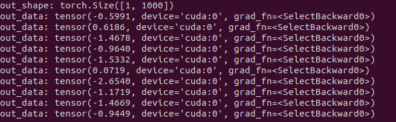
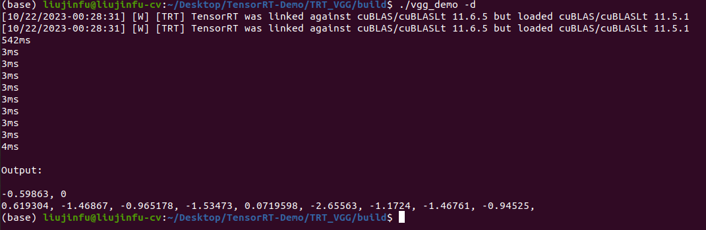

# Prepare Wegihts
```bash
cd weight
python vgg.py
```

# Compile
```bash
mkdir build
cd build
cmake ..
make
# serialize
./vgg_demo -s
# deserialize
./vgg_demo -d
```

# Test by ljf
<div align=center>


</div>


