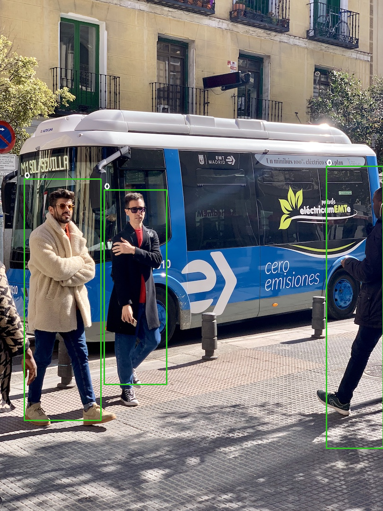

# yolov3-tiny

## download weight
```bash
git clone -b archive https://github.com/ultralytics/yolov3.git
mv gen_wts.py ./yolov3
wget -c https://pjreddie.com/media/files/yolov3-tiny.weights
python gen_wts.py yolov3-tiny.weights
```

## build and run
```bash
mkdir build && cd build
cmake ..
make
# serialize
./yolov3-tiny_demo -s
# deserialize
./yolov3-tiny_demo -d ../sample/bus.jpg
```

<div align=center>

</div>

